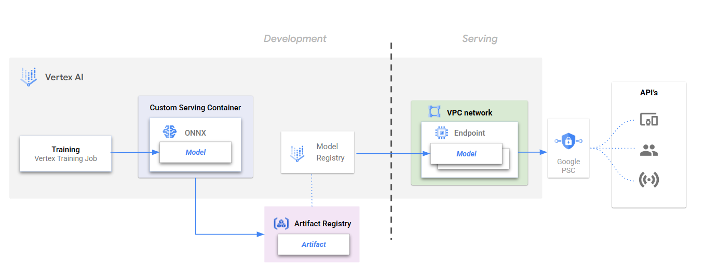

# vertex-psc-benchmark

This project showcases an end-to-end method to serve an ONNX model on Vertex AI PSC Private endpoints using custom serving containers, and includes performance benchmarking.

## Getting started

Once the prerequisites have been met and the user parameters are specified, users can follow the notebook to run through the guided steps.

### Notebooks

* [01-onnx_model_training_and_endpoint.ipynb](./01-onnx_model_training_and_endpoint.ipynb) : This notebook trains a model that is serialized into ONNX format. The model is registered using custom serving containers and deployed onto a PSC private endpoint, ready to serve predictions.

* [02-endpoint-benchmarking.ipynb](./02-endpoint-benchmarking.ipynb) : This notebook assesses the performance of a PSC private endpoint through an example method for load testing and benchmarking charts and metrics

### Prerequisites

Ensure the project environment, network settings, and service accounts used have the appropriate google cloud authentication and permissions to access the folloiwng services:
- `Vertex AI`
- `Cloud Storage`
- `Artifact Registry`

## Workflow

